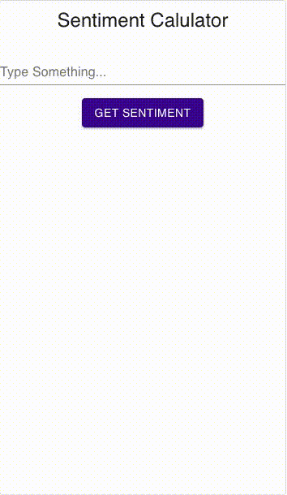

# Sentiment-Scoring

<!--- These are examples. See https://shields.io for others or to customize this set of shields. You might want to include dependencies, project status and licence info here --->

A lightweight web app developed with React and Flask. Sentiment score is calculated from the entered text via [vaderSentiment](https://github.com/cjhutto/vaderSentiment). This project was bootstrapped with [Create React App](https://github.com/facebook/create-react-app).

# Demo

